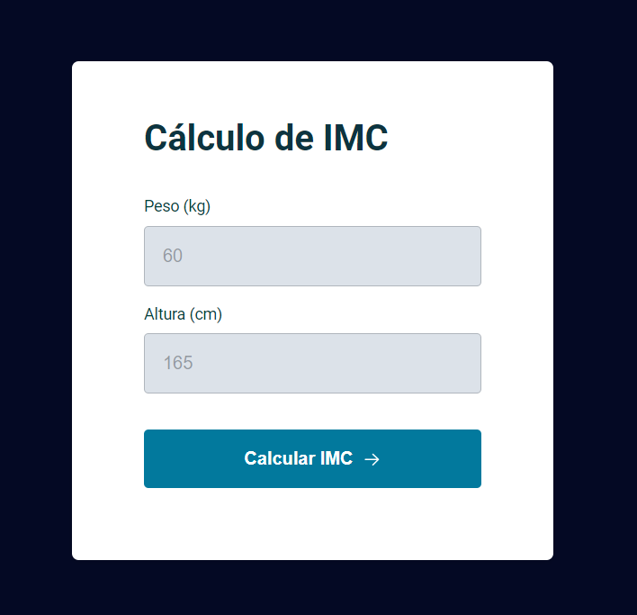

# Calculadora de IMC
Esta é uma simples Calculadora de Índice de Massa Corporal (IMC) desenvolvida utilizando HTML, CSS e JavaScript. O IMC é uma medida amplamente usada para avaliar se uma pessoa está em seu peso ideal, com base na altura e peso.

 

  
  

Tecnologias Utilizadas
HTML5: Utilizado para estruturar a página da web.
CSS3: Responsável pela estilização e layout da aplicação.
JavaScript: Responsável pela interatividade e cálculos dinâmicos.
Funcionalidades
Cálculo de IMC: Insira o peso (em kg) e a altura (em cm) para calcular automaticamente o IMC.
Validação de Entrada: A aplicação valida se os campos de peso e altura contêm apenas números e são obrigatórios.
Exibição de Resultado: Após o cálculo, o IMC é exibido em uma janela modal.

Preencha os campos de peso e altura e clique no botão "Calcular IMC".

Contribuição
Contribuições são bem-vindas! Sinta-se à vontade para enviar pull requests ou abrir issues com sugestões, melhorias ou correções.

Autor
Tiago Lucas da Silva
Licença
Este projeto está sob a licença MIT.

